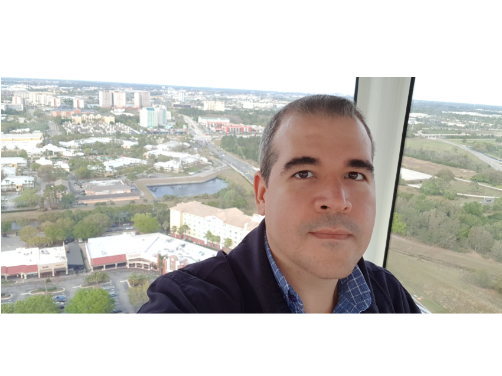

Hi! I'm <strong>Daniel</strong>.

 

I'm a Systems Engineer turned Cloud Engineer passionate with all things cloud.

 
While I currently specialize in Microsoft Azure I love learning new things everyday. 

I love working on projects together, so feel free to reach out for collaboration!

## Who I am
From time to time I work with:

I love creating stuff in computers. Although I'm not a professinal developer, I first fell in love with programming ever since I started learning BASIC in 1990 when I was growing up. I loved the way it allowed me to unleash my creativity while trying to solve problems using technology.

I graduated from college as a System Engineer but ever since then I have been working in the telecommunications industry as a Project Manager. Being part of a telecom company made me learn about networking, wireless networks, manage Linux servers and now the cloud.

## What I like to do

When I'm not working in Azure I like to read, from the latest Stephen King novel or classical (and newer) sci-fi books, to business management and personal development books.

Hobbies:
- Playing guitar
- Listening to podcasts
- Photography ([flickr.com/dfv78](http://flickr.com/dfv78))
- Did I mention [I love reading](https://www.goodreads.com/review/list/4642546-daniel-fajardo-valenti?shelf=read)? 
## What I'm currently doing
I've always enjoyed learning new things so I'm constantly trying to learn about a technology that's new to me:

- Azure SQL databases (I'm in the process of studying for the certification)
- DevOps
- Python
- C#
- PowerShell
  
I'm proud of my certifications, not because I got them but because I loved the journey and they challenged me. Took a lot of dedication, commitment and patience.

 

 

If you reached all the way to end. Thanks for reading!

