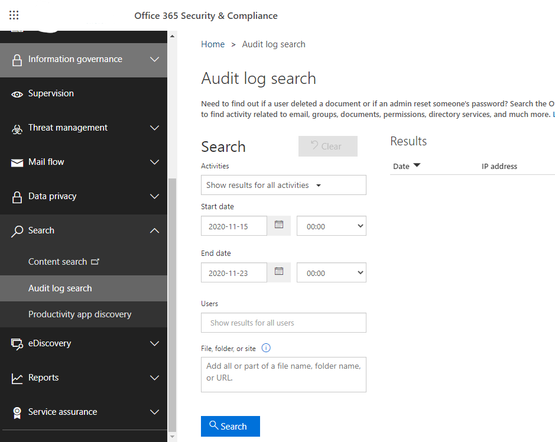
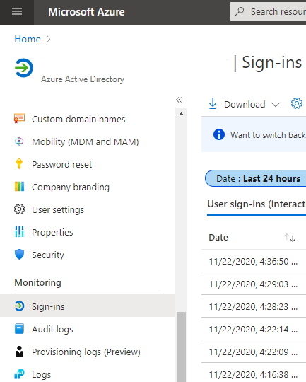
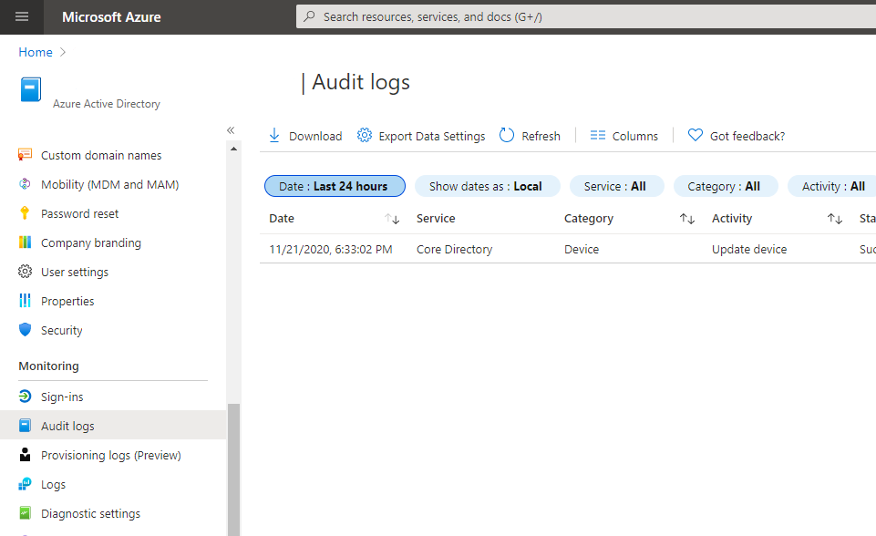
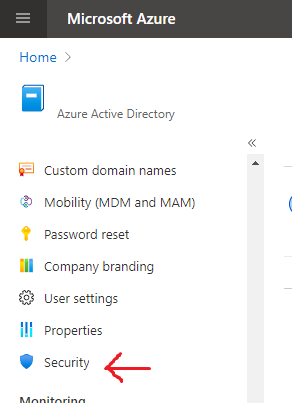
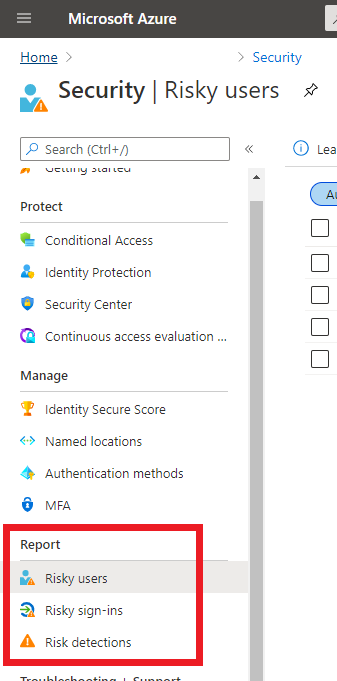
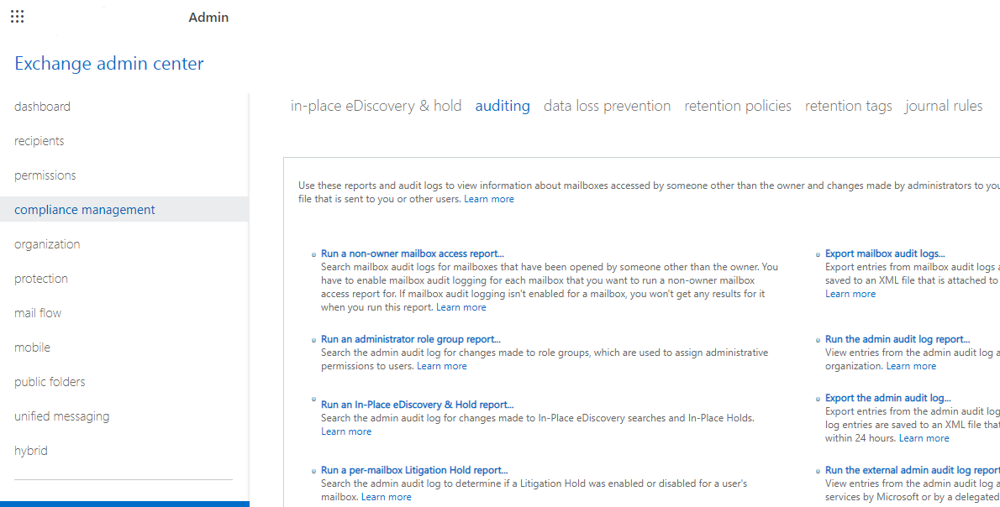
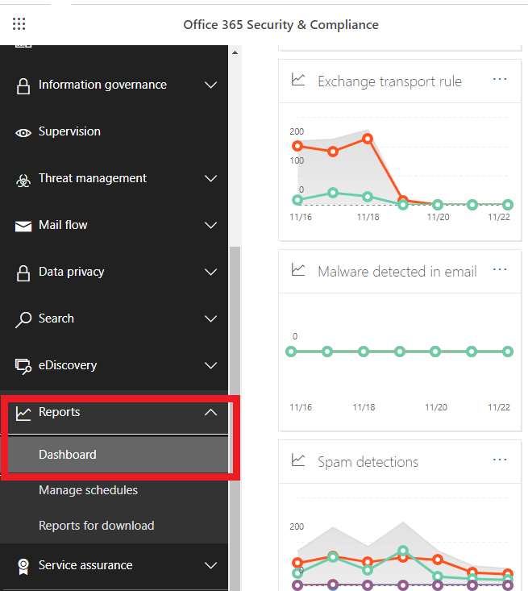
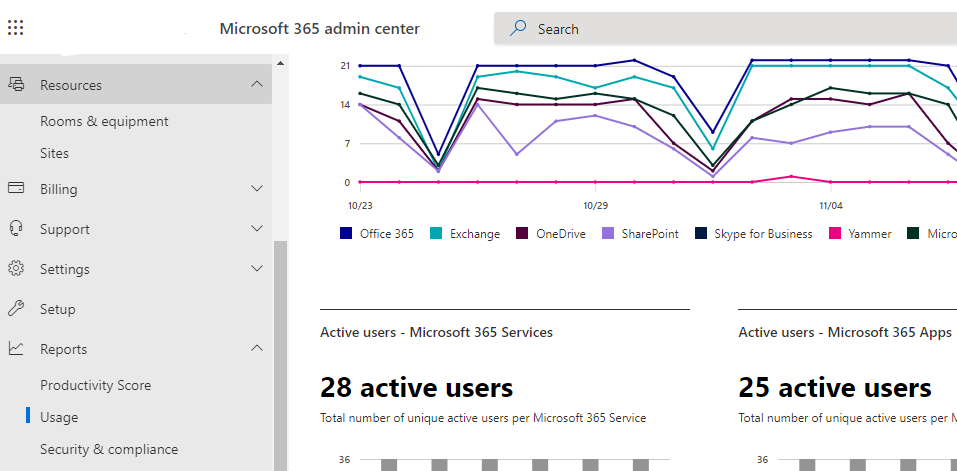

# Microsoft 365 Reports
Microsoft 365 security and compliance reports are split across four categories. These reports allow you to view how security and compliance rules and technologies are being used.

1. Auditing reports
2. Data Loss Prevention reports
3. Protection reports
4. Rules reports
5. Metrics

To view reports in the [Security and Compliance](https://protection.office.com) center you need the following permissions:
- **Security Reader Role in Exchange**. Assigned by default to the Organization Management and Security Reader role groups.

- **DLP Compliance Management Role** in Security & Compliance Center to view DLP reports and policies. Assigned by default to the Compliance Administrator, Organization Management, adn Security Administrator role groups.

----
## 1- Auditing reports
Three reports are available through the [Security and Compliance Center](https://protection.office.com):

### Office 365 Audit Log report
View user and admin activity related to **email, groups, documents, permissions, directory services** including viewing changes made to administrator role groups.

Go directly to the [Office 365 Audit Log report](https://protection.office.com/unifiedauditlog).

Read more 
- Microsoft Docs: [Search the audit log in the compliance center](https://docs.microsoft.com/en-us/microsoft-365/compliance/search-the-audit-log-in-security-and-compliance?view=o365-worldwide)

### Azure AD Reports
These reports are available from the [Azure Portal](https://portal.azure.com) > **Azure Active Directory**.

View Azure Active Directory reports including reports for **unusual or suspicious sign-in activity**. 

The type of reports you can view will depend on the Azure Active Directory subscription. Some reports are included in the Microsoft 365 license, other more advanced reports require Azure Active Directory Premium 1 or Azure Active Directory Premium 2 licenses.

#### Azure AD sign-in activity
The sign-ins report provides information about the usage of managed applications and user sign-in activities.

Go to the [Azure Active Directory sign-ins](https://portal.azure.com/#blade/Microsoft_AAD_IAM/ActiveDirectoryMenuBlade/SignIns) in the Azure Portal under Monitoring.

#### Azure AD audit logs
Provides traceability through logs for all changes done by various features within Azure AD and include changes made to any resources within Azure AD like adding or removing users, apps, groups, roles and policies.

Go to the [Azure Active Directory audit logs](https://portal.azure.com/#blade/Microsoft_AAD_IAM/ActiveDirectoryMenuBlade/Audit) in the Azure Portal under Monitoring.

#### Azure AD security reports
Here you will find the **risky users** (users that might have been compromises) and **risky sign-ins** (sign-in attempt that might have been performed by someone who is not the legitimate owner of a user account).

First, go to the [Security blade](https://portal.azure.com/#blade/Microsoft_AAD_IAM/SecurityMenuBlade/GettingStarted) in the Azure Active Directory.

Then, under **Monitoring** you will find the risky users and sign-ins.

Read more
- Microsoft Docs: [Audit activity reports in the Azure Active Directory portal](https://docs.microsoft.com/en-us/azure/active-directory/reports-monitoring/concept-audit-logs)

### Exchange Audit reports
Use this report to search for mailboxes accessed by prople other than their owners. Requires mailbox audit logging to be enabled.

Go to the [Exchange admin center](https://outlook.office365.com/ecp/), then compliance management, and then auditing.

----
## 2- Data Loss Prevention reports
Here you will find:
- Top DLP policy matches for mail
- Top DLP rule matches for mail
- DLP policy matches by severity for mail
- DLP policy matches, overrides, and false positives for mail

To see the DLP reports, go to [Microsoft 365 Security & Compliance reports](https://protection.office.com/insightdashboard)

----
## 3- Protection reports
Here you will find:
- Top senders and recipients
- Top malware for mail
- Mailware detections
- Spam detetion
- Sent and received mail

Like the DLP reports, you can find the Protection reports in the [Microsoft 365 Security & Compliance](https://protection.office.com/insightdashboard)

## 4- Rules report
You will find:
- Top rule matches for mail
- Rule matches for mail

As before, to access the Rules report you will need to go to [Microsoft 365 Security & Compliance](https://protection.office.com/insightdashboard) reports.

More info:
- Microsoft Docs : [View mail flow reports](https://docs.microsoft.com/en-us/microsoft-365/security/office-365-security/view-mail-flow-reports?view=o365-worldwide)

----
## 5- Microsoft 365 Metrics

Activity reports allow you to view how users are using Microsoft 365 services. You can view reports over periods of 7 days, 30 days, 90 days and 180 days. Reports are not generated immediately, but become available after 48 hours.

Reports can be viewd by users who hold the following roles:
- Office 365 global administrator
- Exchange administrator
- SharePoint administrator
- Skype for Business administrator
- Report reader
- Teams Service Administrator
- Teams Communications Administrator

You can access the Microsot 365 usage metrics throught the [Microsoft 365 Admin Center](https://admin.microsoft.com/AdminPortal/Home#/reportsUsage)

