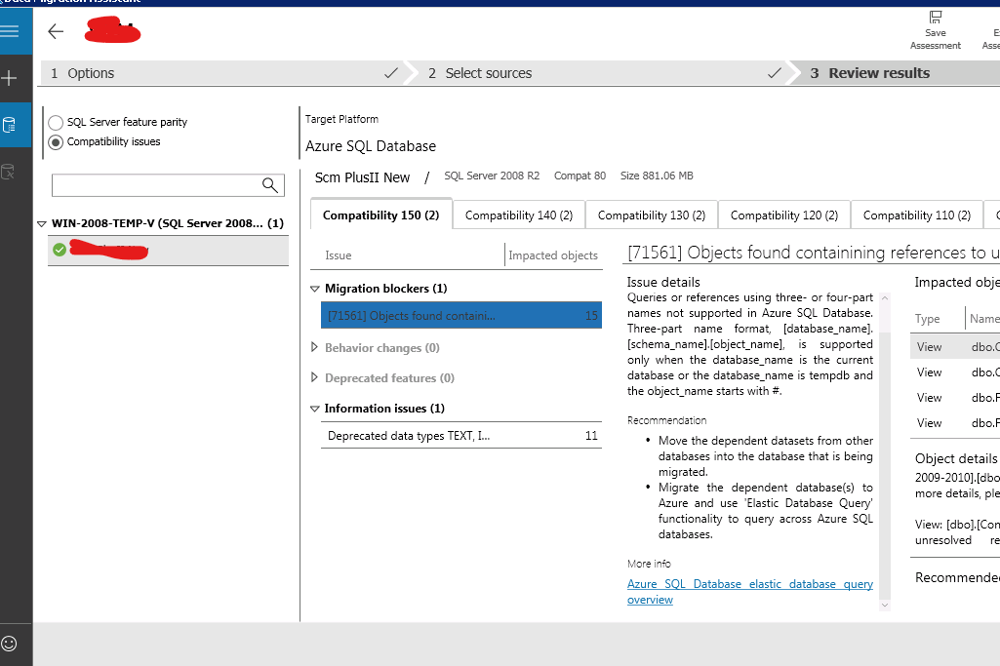

# Migrate SQL Server 2008 to Azure SQL
Now that we have our database upgraded to SQL Server 2008 we can [migrate using the Azure Database Migration Service](https://datamigration.microsoft.com/scenario/sql-to-azuresqldb?step=1).

The steps involved are:
 1. Install Data Migration Assistant (DMA) in our local server
 2. Create a Database Migration Service (DMS) in Azure
 3. Use Azure DMS to migrate

## Data Migration Assistant (DMA) installation
1. We need to [download the DMA](https://www.microsoft.com/en-us/download/details.aspx?id=53595) to our local server.
   
2. After that's installed we create a new assesment project:
   
3. After the assessment is finished and we have checked that everything is okay with the compatability issues we can proceed.
4. 

