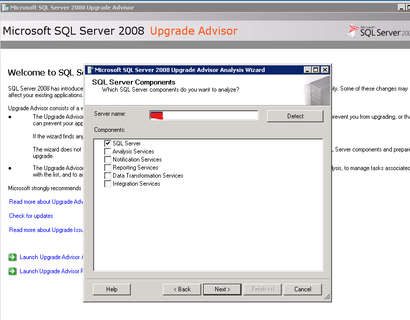
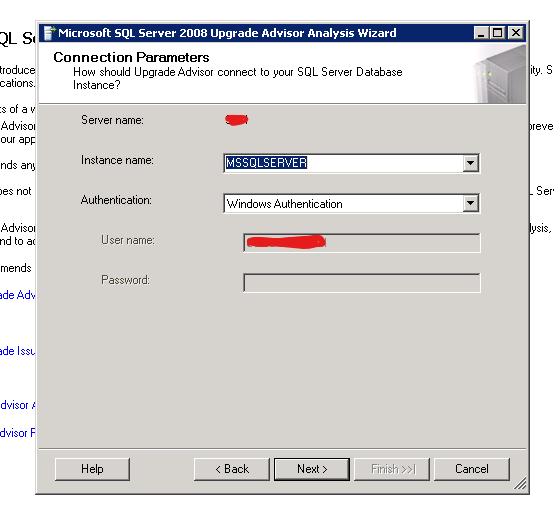

The goal is to upgrade a Microsoft SQL Server 2000 to Azure SQL Database.

Migrating to Azure SQL Database directly from SQL Server using the *Azure Database Migration Service* requires at least SQL Server 2005. We need to upgrade our database to a newer version. In this example I chose to upgrade to SQL Server 2008.

## Update SQL Server 2000 to 2008

1. Download and install the Microsoft SQL Server 2008 Upgrade Advisor in **same server** where the SQL Server 2000 is installed.
  <https://www.microsoft.com/en-us/download/details.aspx?id=11455>
2. Run Microsoft SQL Server 2008 Upgrade Advisor
   We launch the wizard, our database should be detected.
   
3. Select authentication options
   

https://docs.microsoft.com/en-us/archive/blogs/mdegre/migration-sql-server-2000-to-sql-server-2008
