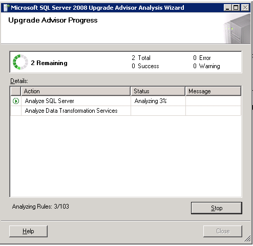
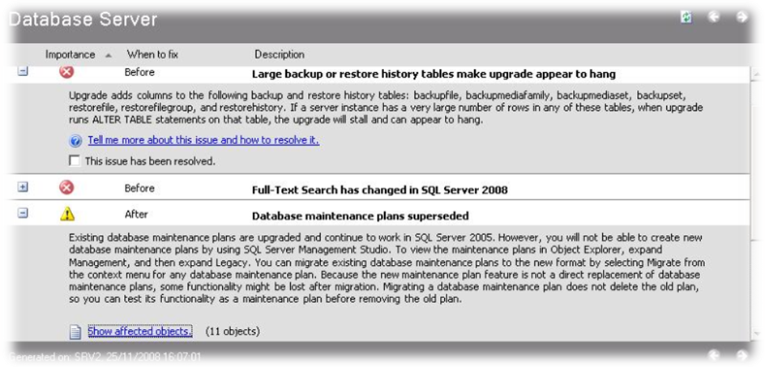

The goal is to upgrade a Microsoft SQL Server 2000 to Azure SQL Database.

Migrating to Azure SQL Database directly from SQL Server using the *Azure Database Migration Service* requires at least SQL Server 2005. We need to upgrade our database to a newer version. In this example I chose to upgrade to SQL Server 2008.

## Upgrade SQL Server 2000 to 2008

### Pre migration steps - Upgrade Advisor
The first thing we must do is to check weather

1. Download and install the Microsoft SQL Server 2008 Upgrade Advisor in **same server** where the SQL Server 2000 is installed.
  <https://www.microsoft.com/en-us/download/details.aspx?id=11455>
2. Run Microsoft SQL Server 2008 Upgrade Advisor
   We launch the wizard, our database should be detected.
   
3. Select authentication options
   
4. Choose database to analyze
   
5. Select Next and on the next screen choose your options for analyzing the rest of SQL Server components if you need to.
   
6. After a few minutes a report will be generated with warnings. These items may include Full Text Search, replication, objects that no longer exist or have been modified in the new version.

Once you fix the warnings or at least you are aware of the features you may lose in SQL Server 2008 the process of migration begins.

### Make a backup of the SQL Server 2000 database

https://docs.microsoft.com/en-us/archive/blogs/mdegre/migration-sql-server-2000-to-sql-server-2008
