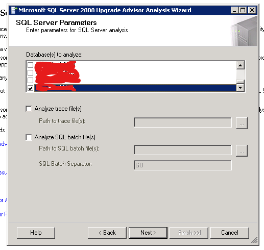
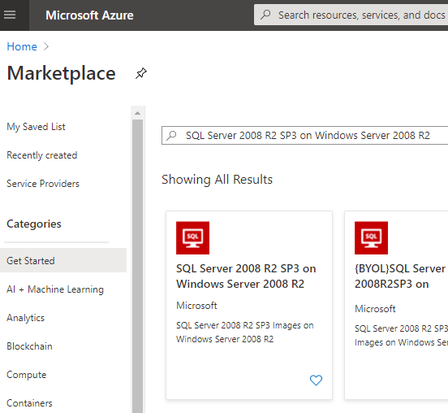
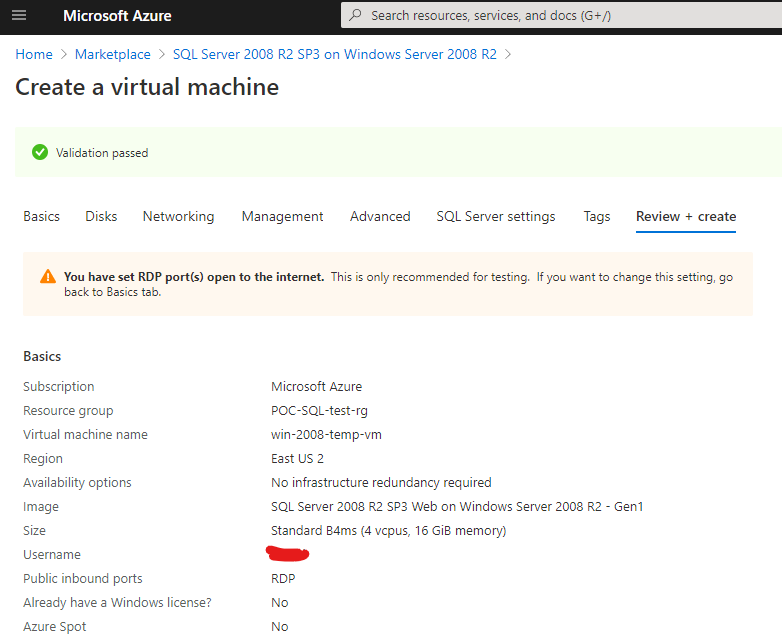
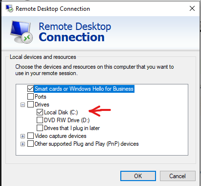
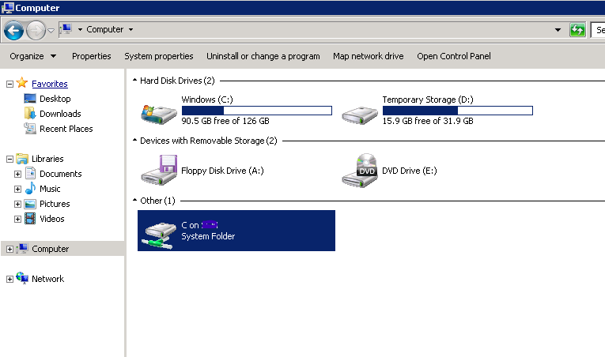
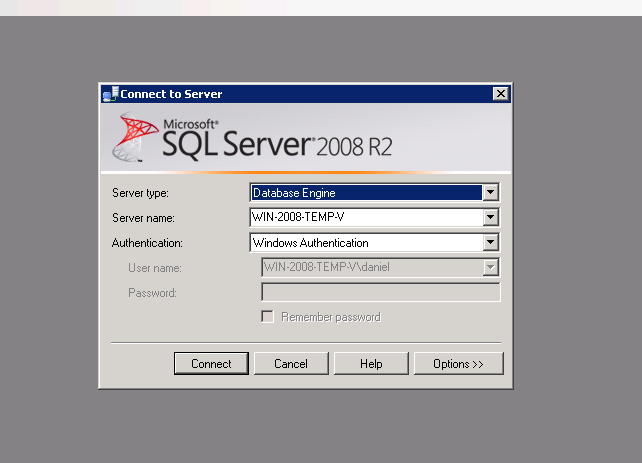
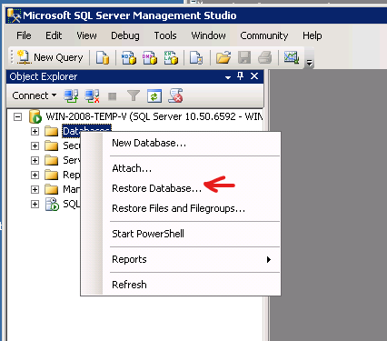
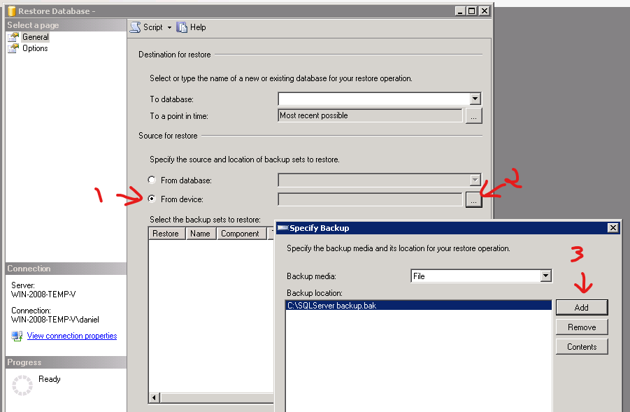
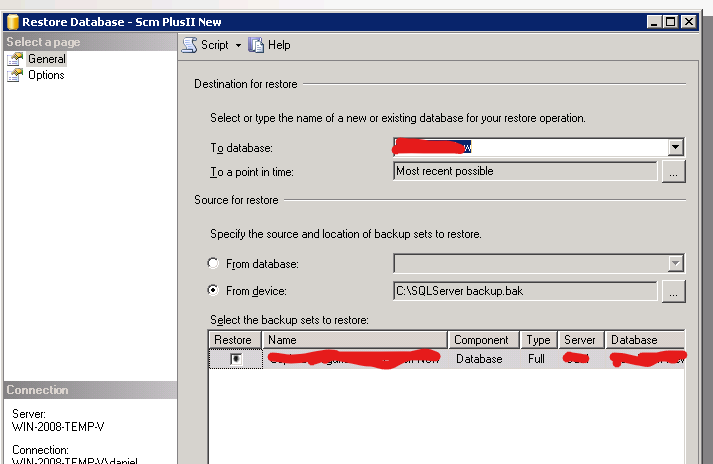

The goal is to upgrade a Microsoft SQL Server 2000 to Azure SQL Database.

Migrating to Azure SQL Database directly from SQL Server using the *Azure Database Migration Service* requires at least SQL Server 2005. We need to upgrade our database to a newer version. In this example I chose to upgrade to SQL Server 2008.

# Upgrade SQL Server 2000 to 2008

## Pre migration steps - Upgrade Advisor
The first thing we must do is to check weather 

The SQL Server 2000 must have installed SP4. If it's not installed we need to install it first.

1. Download and install the Microsoft SQL Server 2008 Upgrade Advisor in **same server** where the SQL Server 2000 is installed.
  <https://www.microsoft.com/en-us/download/details.aspx?id=11455>
2. Run Microsoft SQL Server 2008 Upgrade Advisor
   We launch the wizard, our database should be detected:
   
3. Select authentication options:
   
4. Choose database to analyze:
   
5. Select Next and on the next screen choose your options for analyzing the rest of SQL Server components if you need to:
   
6. After a few minutes a report will be generated with warnings. These items may include Full Text Search, replication, objects that no longer exist or have been modified in the new version:

Once you fix the warnings or at least you are aware of the features you may lose in SQL Server 2008 the process of migration begins.

## Make a backup of the SQL Server 2000 database
Find url----

## Import SQL Server 2000 backup to SQL Server 2008
### Create interim SQL server 2008 in Azure
For the interim SQL server 2008 DB we'll create a VM in Azure.

We'll be using the image in Azure for SQL Server 2008 R2 that comes in Windows Server 2008 R2.

We create the VM in Azure

Now, we need to transfer the SQL Server 2000 backup to the VM in Azure. One easy way to do this is to RDP from the server that has the backup to the VM in Azure with the options to access local resources:

From our Windows Server 2008 VM in Azure we can now access our local drive to copy the backup:

### Import SQL Server 2000 backup to SQL Server 2008
1. For the actual importing we'll use SQL Server Management Studio (SSMS) according to these instructions: <https://docs.microsoft.com/en-us/sql/relational-databases/backup-restore/restore-a-database-backup-using-ssms>
2. We launch SSMS 2008 from our VM running SQL Server 2008:
   
3. Right click Databases and select **Restore Database**:
   
4. Select backup:

5. Select destination for restore:

Once that finishes we'll see a message saying that the import was successful. 
6. I won't cover it in detail but if you also need to copy the database users and SQL Server Agent jobs you can do it the following through scripts you can find on the internet or using the following:

- Copy database users / logins
  - SQL Server Integration Services using "Transfer Login task"
  - SQL Server Management Studio, with "Copy Database Wizard"

- Copy SQL Server Agent jobs
  - You can migrate your SQL Server Agent jobs using Enterprise Manager 2000. You can find more detail in the documentation: [How to script jobs using Transact-SQL (Enterprise Manager)](http://msdn.microsoft.com/en-us/library/aa177024(SQL.80).aspx)

References:
- [Migration SQL Server 2000 to SQL Server 2008](https://docs.microsoft.com/en-us/archive/blogs/mdegre/migration-sql-server-2000-to-sql-server-2008)